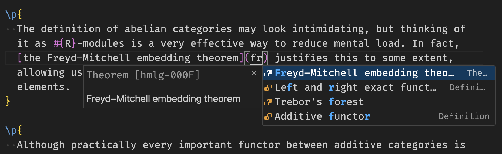

# vscode-forester

Some basic VSCode support for [Forester](https://www.jonmsterling.com/jms-005P.xml), a tool for tending forests of evergreen notes.

## Features

- Language highlight.
  - Use `\startverb%tex` to retain TeX highlighting (which agrees with whatever TeX language support you happen to have installed) in verbatim environments. Otherwise the verbatim part will not be highlighted.
- Tree ID completion: **You can type in a part of the title/ID/taxon to filter for trees. Press tabs to insert the ID (which will replace the title you entered).**
- Tree creation: right-click on a folder and select the "New Tree..." item, which guides you in creating a new tree.

### To do

- [ ] Language highlight
  - [ ] Escapes are not quite right yet, though I'm not sure forester is doing it right either
  - [X] ~~Embedded formula highlight~~ (pretending it's plain forester syntax is good enough)
- [ ] Convenience features
  - [ ] Hover/Inlay hint of link titles
  - [ ] Rename links upon tree renaming
  - [ ] Advanced language features (this is not doable without a forester LSP)
  - [ ] Formula preview (hard without forester LSP, since macros are evaluated by forester)
  - [ ] Shift-click to jump to file (how do we locate anything? we need more stuff for `forester query`)
  - [ ] Build on save
    - [ ] error reporting (maybe we ask forester to not include those fancy stuff in error reports)
- [ ] Improve the tree creation UX
- [X] ~~Integrate with the edit button?~~ (it's doing fine on its own)

## Requirements

You need forester installed, see [here](https://www.jonmsterling.com/jms-005P.xml) for the instructions. Configure the paths in the settings. Since this plugin is in early development, you will often need the `HEAD` commit of forester to be compatible.

## Extension Settings

- Use `forester.path` to configure the path to forester. It needs to include the name of the executable too.
- Use `forester.config` to specify the forester config file. This should usually be edited per workspace, instead of globally.
  - In the toml file, add a line `prefixes = ["prfx", ...]` to specify the prefixes to pick from. This is used when creating new trees.
- Use `forester.completion.showID` to toggle whether the tree ID is shown in completions. It is recommended to use smaller fonts when switching on this feature. There are also plugins to create keybindings for setting toggles, in case you need to switch it on and off quickly. VSCode also has a lot of useful settings in the `editor.suggest` section worth looking at in conjunction.
- Use `forester.create.random` to control whether the tree ID is generated randomly or sequentially.

## Known Issues
